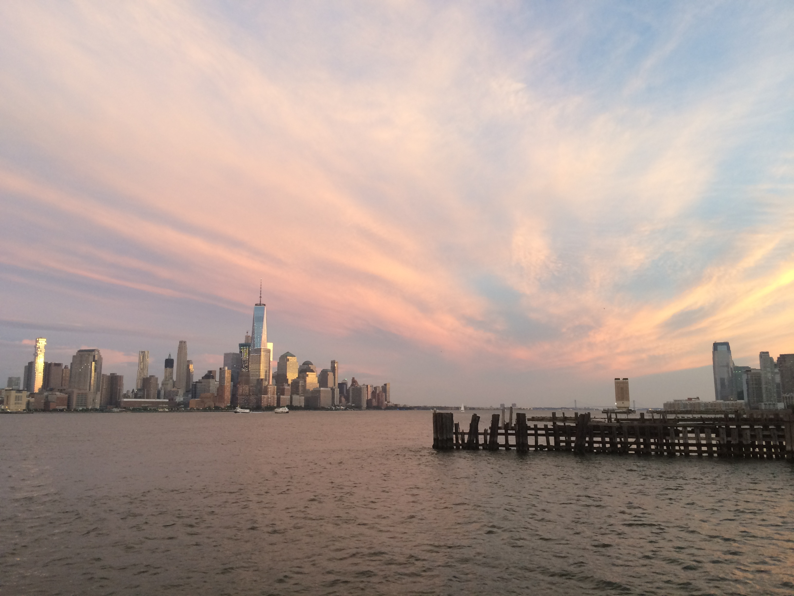

title: about
date: 2016-04-02 00:26:04
type: "about"

---

**华南皇家理工 South China University of Technology** *SE 2012～2016*

**Stevens institute of technology** *CS 2016～2018*

   * 学校景色一流，尤其是食堂，据说是全世界唯一一个可以看到曼哈顿全景的食堂……然后就没别的优点了
   

   
    
 
 **BGC Partners Summer Intern** *2017.06~2017.08*

 **Teaching Assistant of Computer Science Department** *2017.09 ~ 2018.06*

------